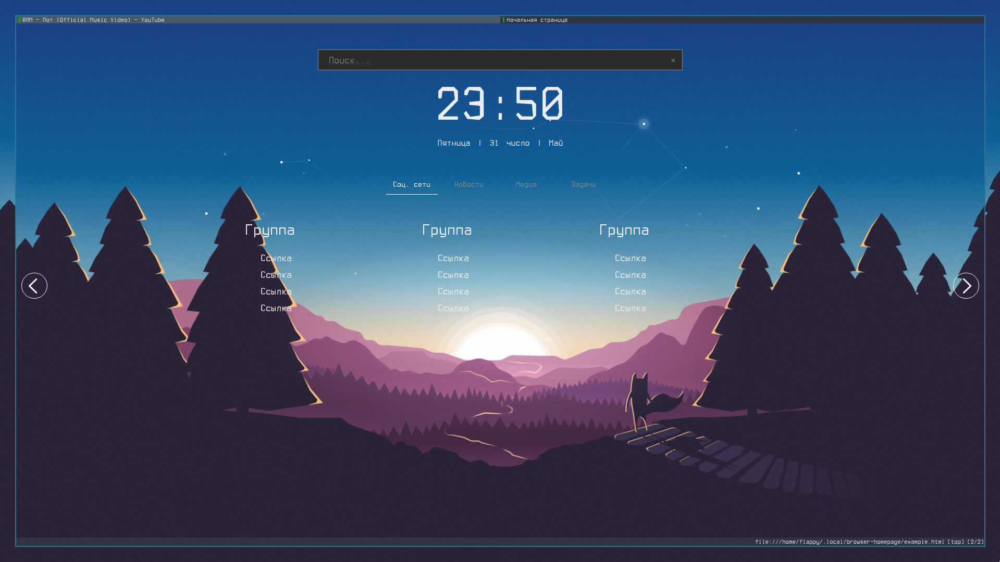
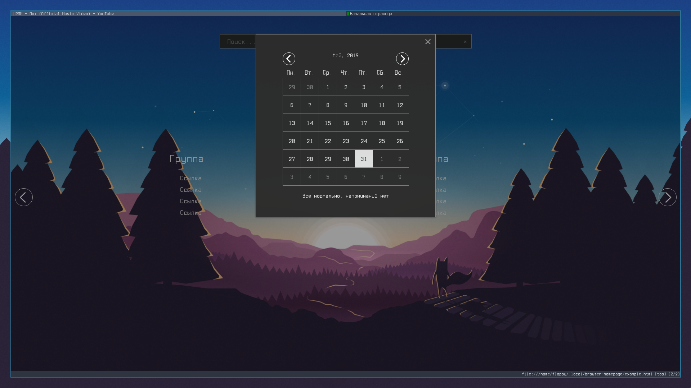
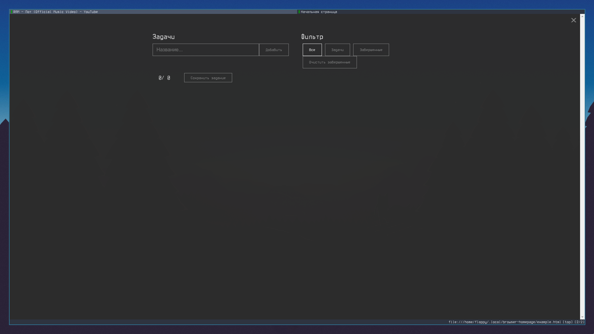

# Browser homepage

Пользовательская домашняя страница браузера, для замены стартовой страницы. Она должна работать в любом современном браузере, просто установите index.html в качестве домашней страницы и добавьте свои собственные ссылки.

# Характеристики

* Поиск (в Google или DuckDuckGo)
* Часы
* Календарь
* Обратный отсчет до пользовательской даты
* Управление задачами
* Организация ссылок так, как вы хотите


# Скриншоты

Начальная страница


Календарь


Задачи



# Добавление ссылок
Ссылки должны быть добавлены непосредственно в `<div class="slides-container"` в файле index.html. Например:

```html
<div class="slide" name="Reddit">
    <div class="part">
        <h1> Reddit </h1>

        <div class="links">
            <a href='https://www.reddit.com/r/unixporn/'> r/Unixporn </a>
            <a href='https://www.reddit.com/r/nosleep/'> r/Nosleep </a>
            <a href='https://www.reddit.com/r/homelab/'> r/HomeLab </a>
            <a href='https://www.reddit.com/r/sysadmin/'> r/SysAdmin </a>
            <a href='https://www.reddit.com/r/webdev/'> r/WebDev </a>
            <a href='https://www.reddit.com/r/devops/'> r/DevOps </a>
        </div>
    </div>
</div>
```
* Div с классом slide используется для названия кнопки (в строке под часами)
* h1 используется для отображения заголовка над группой ссылок. Один слайд может иметь много ссылок


# Советы по использованию
* Поисковый ввод поддерживает алиасы (`:Command`).
* В настоящее время поддерживаются алиасы:

    | команда  | фраза поиска | поисковая система |
    | -------- | --------- | -------   |
    | :y       | search    | youtube   |
    | :m       | search    | moonwalk  |
    | :l       | search    | LOR       |
    | :w       | search    | Wikipedia |
    | :g       | search    | Google    |
    | :d       | search    | DuckDuckGo|
    | :a       | search    | ArchWiki  |

    Пример использования

        # попробуйте ввести это в строке поиска
        :y Как работает Google # выполняет поиск на YouTube: Как работает Google

* Заметки автоматически сохраняются при нажатии кнопки закрытия (X) в верхнем правом углу. Вы также можете сохранить их вручную с помощью кнопки «сохранить задачи»

## Структура кода

```
├── components
│   ├── calendar.js
│   ├── clock.js
│   ├── countdown.js
│   ├── notes.js
│   ├── search-box.js
│   └── slides.js
├── css
│   ├── main.css
│   └── main.styl
```

* Components folder: contains every part/component of the browser homepage.
    * `calendar.js` -> содержит код для отображения календаря при нажатии на часы
    * `clock.js` -> отображает часы и дату на первой странице
    * `countdown.js` -> отображает обратный отсчет в календаре. Мы можем вызвать его внутри index.html или внутри нашего собственного скрипта через `countDown({'y': year, 'm': month, 'd': day}, msg)`
    * `notes.js` -> содержит код для управления задачами
    * `search-box.js` -> contains code for search input on the front page
    * `slides.js` -> содержит код для ввода поиска на первой странице
    * `index.html` -> содержит код главной страницы
    * `main.scss` -> основной файл styl (если вы хотите изменить цвета, измените их здесь) и скомпилируйте его в main.css, который используется index.html