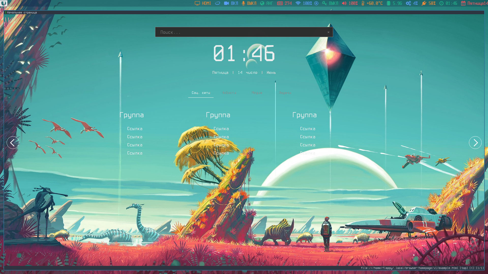

# Тайловый i3-gaps
*Личные настройки и скрипты для [i3-gaps](https://github.com/Airblader/i3).*

# Зависимости:

-   Python 3
-   [i3-gaps-next](https://github.com/Airblader/i3)
-   [i3ass](https://github.com/budlabs/i3ass)
-   [Polybar](https://github.com/jaagr/polybar)
-   [Dmenu-manjaro](https://github.com/manjaro/packages-community/tree/master/dmenu-manjaro)
-   [Dunst](https://github.com/dunst-project/dunst)
-   [Rofi](https://github.com/DaveDavenport/rofi)
-   [Font-Awesome-5](https://fontawesome.com/)
-   [Terminus Font](https://aur.archlinux.org/packages/terminus-font-ll2-td1-ttf/)
-   [Iosevka Nerd Font](https://github.com/ryanoasis/nerd-fonts)

# Установка

      git clone https://github.com/alexandrovich-ff/dotfiles

          pacman -S dunst rofi ttf-font-awesome
          yay -S i3-gaps-next-git polybar terminus-font-ll2-td1-ttf nerd-fonts-complete skippy-xd-git
          pacman -U .config/dmenu-manjaro/dmenu-manjaro.tar.xz

### v0.1 [alpha]
